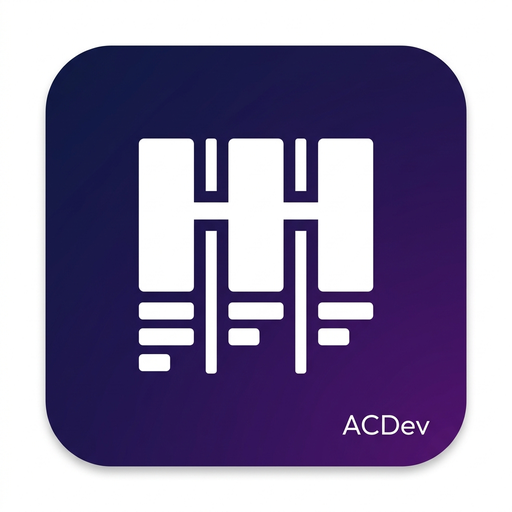

# MyTrello by ACDev

<div align="center">
  

  <h3>Espacio de Trabajo Kanban Colaborativo, Moderno y Auto-Hospedado</h3>

  [](https://nextjs.org/)
  [](https://react.dev/)
  [](https://tailwindcss.com/)
  [](https://prisma.io/)
  [](https://docker.com/)
  [](https://github.com/WadeWatts9/mytrello/pkgs/container/mytrello)
</div>

---

## 📖 Descripción General

**MyTrello** es una plataforma integral de gestión visual de proyectos tipo Kanban diseñada con estética **Glassmorphism**, pensada para ser liviana, rápida y 100% auto-hospedada en servidores locales, homelabs y sistemas operativos como **ZimaOS**, **CasaOS** o cualquier entorno compatible con **Docker**.

A diferencia de soluciones pesadas en la nube, MyTrello almacena todos sus datos (base de datos relacional y archivos adjuntos) en un único contenedor persistente con SQLite y Prisma, garantizando privacidad, portabilidad y bajo consumo de recursos.

---

## 🛠️ Stack Tecnológico Explicado

| Capa / Módulo | Tecnología | Justificación y Función en el Proyecto |
| :--- | :--- | :--- |
| **Framework Core** | **Next.js 16 (App Router)** | Renderizado híbrido eficiente, Route Handlers para la API REST, Server Actions y empaquetado optimizado en modo `standalone` para contenedores ultralivianos. |
| **Biblioteca de UI** | **React 19** | Manejo de componentes interactivos con el nuevo compilador de React, optimización de hooks (`useMemo`, `useEffect`) y estado concurrente sin bloqueos de render. |
| **Estilos & Diseño** | **Tailwind CSS v4 + Glassmorphism** | Motor de diseño con degradados violeta/neón, paneles con desenfoque de fondo (`backdrop-blur`), bordes translúcidos y paleta adaptable a modo oscuro y claro. |
| **Drag & Drop** | **@dnd-kit (Core & Sortable)** | Arrastre y soltar fluido tanto de **tarjetas** entre columnas como de **columnas completas** en el tablero horizontal, con detección de colisiones (`closestCorners`) y soporte táctil/mouse. |
| **Base de Datos & ORM** | **SQLite + Prisma ORM 5.22** | Almacenamiento local en un archivo `dev.db` persistente. Prisma gestiona el esquema de tablas, relaciones y transacciones seguras para reordenamiento masivo sin pérdida de datos. |
| **Autenticación** | **NextAuth.js v4 + bcrypt** | Sesiones JWT sin estado, cifrado de contraseñas con `bcrypt` (12 rondas de salt). Detección dinámica del encabezado `Host` para funcionar automáticamente en cualquier IP local (`192.168.x.x`), dominio o localhost. |
| **Almacenamiento Multimedia** | **Pipeline Local de Uploads** | Carga y entrega de imágenes de portada, avatares y archivos adjuntos directamente en el volumen de datos persistente (`/app/data/uploads`), con cabeceras HTTP de caché inmutable. |
| **Contenedorización & CI/CD** | **Docker Alpine + GitHub Actions** | Imagen multi-etapa basada en `node:20-alpine`, ejecución con usuario no-root (`nextjs`), y compilación automática continua en **GitHub Container Registry** (`ghcr.io`). |

---

## ✨ Características Principales

### 📋 Gestión de Tableros (Dashboard)
- **Tableros Personales y Compartidos**: Crea tableros privados o colabora en equipo.
- **Portadas Personalizadas**: Asigna imágenes de portada a los tableros mediante carga local o URLs externas.
- **Reordenamiento de Tableros**: Controles rápidos de desplazamiento (`◀` / `▶`) en la grilla principal para ordenar tus proyectos.
- **Favoritos**: Marca tableros clave con estrella para acceso rápido.
- **Buscador Universal (`⌘K`)**: Filtra tableros por título en tiempo real.

### 🗂️ Columnas Avanzadas e Interactivas
- **Arrastrar y Soltar**: Reordena las columnas arrastrando su manejador (`drag_indicator`).
- **Fijar Columnas (`📌`)**: Ancla columnas prioritarias (por ejemplo, "En Progreso") al inicio del tablero.
- **Edición Rápida de Nombre**: Haz clic en el título de cualquier columna o en su botón de lápiz (`edit`) para renombrarla al instante con `Enter` o `✓`.
- **Paleta de 7 Colores**: Destaca columnas con acentos visuales (**Estándar**, **Violeta Neón**, **Verde Éxito**, **Ámbar Alerta**, **Rosa Urgente**, **Cian Técnico**, **Azul Enfoque**).
- **Controles de Desplazamiento**: Botones laterales rápidos para mover columnas a la izquierda o derecha.

### 🃏 Tarjetas Enriquecidas (Rich Cards)
- **Creación en un Clic**: Añade tarjetas rápidas desde el pie de cada columna o el botón superior.
- **Portadas y Adjuntos**: Galería de imágenes cargadas o enlaces directos.
- **Hashtags y Filtros Rápidos**: Asigna tags tipo `#Frontend`, `#Sprint25`. La barra superior contabiliza los tags más usados y permite filtrar tarjetas con un clic.
- **Enlaces con Detección Automática**: Agrega URLs externas con extracción de favicon e icono de acceso directo.
- **Archivo de Tarjetas**: Archiva tarjetas finalizadas para limpiar el tablero y recupéralas o elimínalas definitivamente desde el modal de archivo.

### 👥 Control de Acceso y Roles Granulares
- **Rol Administrador (`ADMIN`)**: Control total de la plataforma, creación de usuarios, gestión de tableros y panel de administración.
- **Rol Estándar (`USER`)**: Creación de tableros propios y participación en proyectos compartidos.
- **Permisos por Tablero**:
  - `Propietario (Owner)`: Control total del tablero, miembros y eliminación.
  - `Editor`: Crear, mover, editar tarjetas y columnas.
  - `Lector (Viewer)`: Modo de solo lectura; arrastre y modificaciones deshabilitados.

### 👤 Perfil de Usuario
- **Avatar Personalizado**: Sube una foto de perfil desde tu computadora con autoguardado instantáneo o ingresa una URL externa.
- **Actualización de Credenciales**: Cambio seguro de contraseña con verificación de clave actual.
- **Métricas de Cuenta**: Resumen de tableros propios y tableros compartidos.

---

## 🚀 Primer Inicio y Configuración Inicial (Onboarding)

> [!IMPORTANT]
> **No existen contraseñas predeterminadas ni credenciales genéricas inseguras.**
> En el primer despliegue, la aplicación detecta automáticamente que la base de datos está vacía y te redirige a la pantalla de bienvenida y configuración: `/setup`.

1. Abre tu navegador e ingresa a la dirección de tu servidor (ej. `http://192.168.1.40:3004` o `http://localhost:3004`).
2. Se abrirá automáticamente la pantalla **Configuración Inicial - Crear Administrador**.
3. Ingresa:
   - **Nombre completo o alias** (ej. `Alan Canto`).
   - **Correo electrónico** (ej. `admin@empresa.com`).
   - **Contraseña segura** (mínimo 6 caracteres).
4. Haz clic en **Crear Cuenta de Administrador e Iniciar Sesión**.
5. ¡Listo! Tu cuenta de administrador quedará creada y accederás inmediatamente al panel principal.

---

## 🐳 Despliegue con Docker y ZimaOS

### Opción 1: Despliegue en ZimaOS / CasaOS (Recomendado)

1. En la interfaz web de **ZimaOS / CasaOS**, abre la **App Store**.
2. Haz clic en el botón `+` (**Custom Install**) en la esquina superior derecha.
3. Haz clic en **Import** (esquina superior derecha del modal) y pega la siguiente configuración:

```yaml
version: '3.8'

services:
  mytrello:
    image: ghcr.io/wadewatts9/mytrello:latest
    container_name: mytrello
    restart: unless-stopped
    ports:
      - "3004:3004"
    volumes:
      - /DATA/AppData/mytrello/data:/app/data
    environment:
      - NODE_ENV=production
      - PORT=3004
      - DATABASE_URL=file:/app/data/dev.db
      - NEXTAUTH_SECRET=cambia_esta_clave_secreta_por_una_aleatoria
```

4. Haz clic en **Submit / Instalar**.
5. Abre `http://<IP-DE-TU-ZIMAOS>:3004` y completa la configuración inicial.

---

### Opción 2: Docker Compose Estándar (Linux, Mac o Windows)

1. Crea una carpeta y dentro guarda un archivo `docker-compose.yml`:

```yaml
version: '3.8'

services:
  mytrello:
    image: ghcr.io/wadewatts9/mytrello:latest
    container_name: mytrello
    restart: unless-stopped
    ports:
      - "3004:3004"
    volumes:
      - mytrello_data:/app/data
    environment:
      - NODE_ENV=production
      - PORT=3004
      - DATABASE_URL=file:/app/data/dev.db
      - NEXTAUTH_SECRET=genera_una_clave_secreta_larga_aqui

volumes:
  mytrello_data:
```

2. Ejecuta:

```bash
docker compose up -d
```

3. Para actualizar a la última versión en cualquier momento:

```bash
docker compose pull && docker compose up -d --force-recreate
```

---

## 📁 Estructura del Código

```
mytrello/
├── prisma/
│   └── schema.prisma           # Modelos de base de datos (User, Board, Column, Card, Tag, etc.)
├── public/
│   ├── logo.png                # Logotipo oficial de MyTrello
│   └── favicon.png             # Icono de navegador
├── src/
│   ├── app/
│   │   ├── api/
│   │   │   ├── auth/           # Endpoint NextAuth con detección dinámica de IP/Host
│   │   │   ├── boards/         # CRUD de tableros, columnas, miembros y reordenamiento
│   │   │   ├── cards/          # CRUD de tarjetas, checklist, tags y archivo
│   │   │   ├── setup/          # Endpoint para creación inicial del primer admin
│   │   │   ├── upload/         # Subida de fotos y archivos al volumen persistente
│   │   │   └── users/          # Administración y perfil de usuarios
│   │   ├── admin/              # Panel de administración de cuentas y tableros
│   │   ├── board/[id]/         # Tablero Kanban interactivo (DnD, colores, edición)
│   │   ├── login/              # Acceso al sistema (por correo o alias)
│   │   ├── profile/            # Configuración de usuario y avatar
│   │   ├── setup/              # Asistente de primer inicio
│   │   ├── globals.css         # Estilos Glassmorphism, temas y Tailwind v4
│   │   ├── layout.tsx          # Layout raíz y SessionProvider
│   │   └── page.tsx            # Dashboard principal de tableros
│   ├── components/
│   │   ├── Navbar.tsx          # Barra superior con avatar de usuario y buscador
│   │   ├── Footer.tsx          # Pie de página institucional de ACDev
│   │   └── Icons.tsx           # Iconos SVG y símbolos del sistema
│   └── lib/
│       └── prisma.ts           # Cliente singleton de Prisma ORM
├── docker-compose.yml          # Manifiesto de despliegue para Docker
├── Dockerfile                  # Empaquetado multi-etapa standalone
├── start.sh                    # Script de arranque (migraciones automáticas SQLite)
└── package.json                # Dependencias y scripts del proyecto
```

---

## 🔒 Variables de Entorno

| Variable | Requerida | Valor por Defecto | Descripción |
| :--- | :---: | :--- | :--- |
| `DATABASE_URL` | No | `file:/app/data/dev.db` | Cadena de conexión SQLite persistida en el volumen de datos. |
| `NEXTAUTH_SECRET` | Sí | `change_this_secret` | Llave secreta para la firma y cifrado de los tokens JWT de sesión. |
| `PORT` | No | `3004` | Puerto interno en el que escucha el servidor Next.js. |
| `NODE_ENV` | No | `production` | Modo de ejecución de la aplicación. |

*(Nota: `NEXTAUTH_URL` se resuelve dinámicamente de forma automática a partir del Host de cada petición, permitiendo que la app funcione sin reconfigurar variables si cambia la IP del servidor).*

---

## 📄 Licencia

Desarrollado por **Alan Canto** — Todos los Derechos Reservados **ACDev**.
Distribuido bajo licencia **MIT**. Consulte el archivo `LICENSE` para más detalles.
